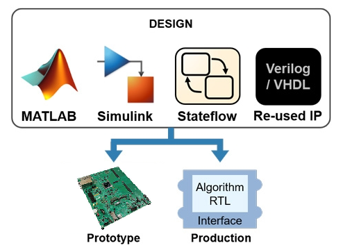
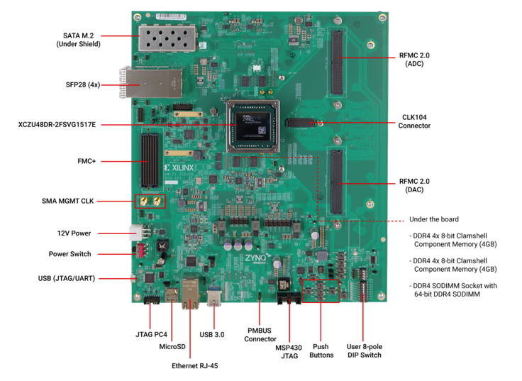

*********************************************************
Introducing Tria HDL Coder Tools for AMD RFSoC Boards
*********************************************************

These instructions detail setup and usage of MathWorks HDL Coder tools for
the following boards:

* :doc:`AMD ZCU208 devlopment board featuring the RFSoC
  Gen 3 ZU48DR device <./zcu208>`

.. note:: Click links above to access the documentation
.. note:: Learn more about MathWorks HDL Coder tools: `here <https://www.mathworks.com/products/hdl-coder.html>`__
.. note:: Learn more about AMD RFSoC devices: `here <https://www.amd.com/rfsoc>`__
